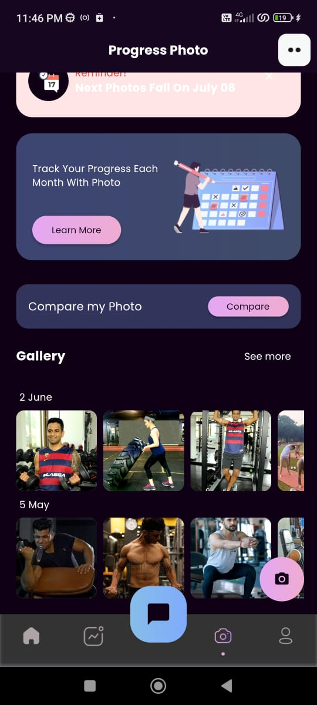
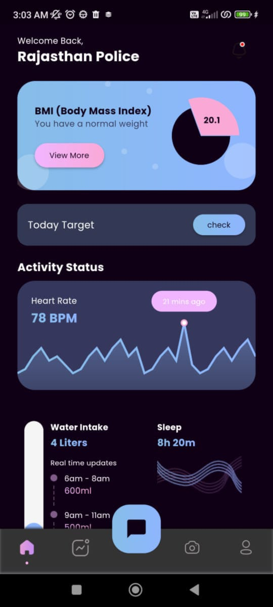
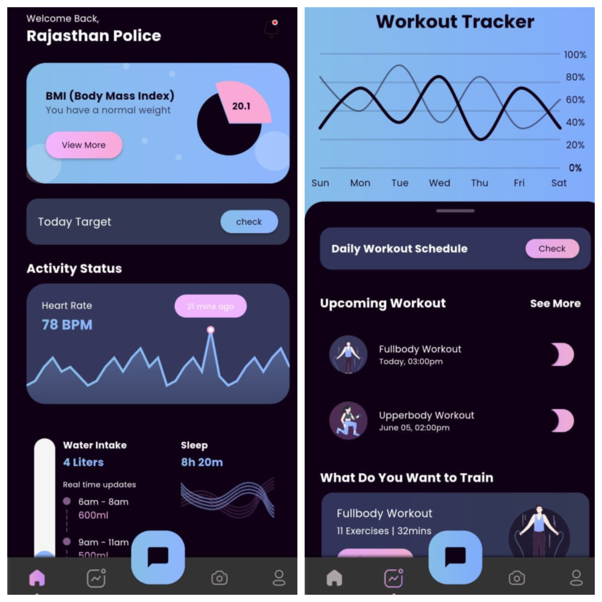
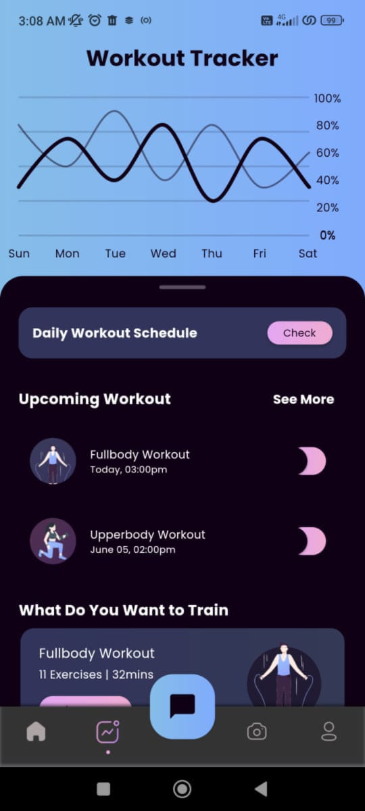
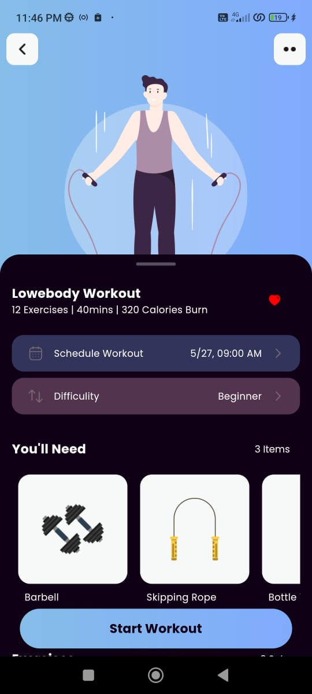
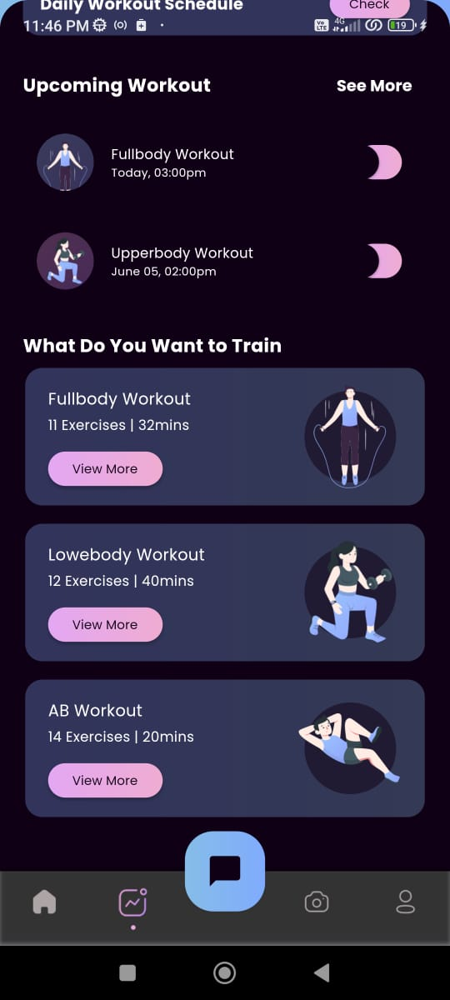
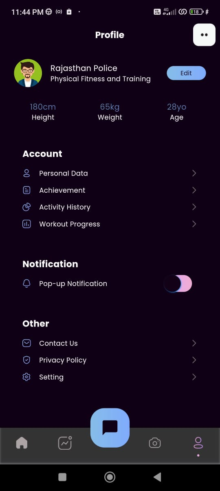
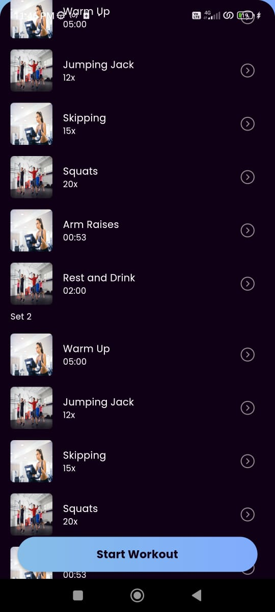

<h1 align ="center">AI Virtual Fitness Training App</h1>

 
>### This AI training app will help in detecting the performance of the police officials while training in VR. It displays the report of a officer generated with respect to the performance analysis inside the VR Simulation.
>### It detects the features of the officer during training such as *heart rate, emotion and stress* under several situations inside VR.

## Features

- Material mobile UI/UX design.
- Workout tracker
- Workout schedule.
- Exercises details with steps.
- Progress photo gallery 

## Screenshots

## Tech Used

* [Flutter](https://flutter.dev/)
* [Dart](https://dart.dev/)
* [Firebase](https://firebase.google.com/)
* [Material 3](https://m3.material.io/)
* [Open AI API (DALL-E)](https://openai.com/blog/openai-api)
* [Figma](https://www.figma.com/)

## Used By

#### This project has been tried and tested by Uttar Pradesh Police Training Grounds, along with that many students and faculty also have tested for the same.

## Future Scope

- Exploring Voice Recognition and dialogue management
- Addition of multilingual support:
- Integration with other government services, such as transportation, healthcare, or social welfare, to provide a more comprehensive user experience.
